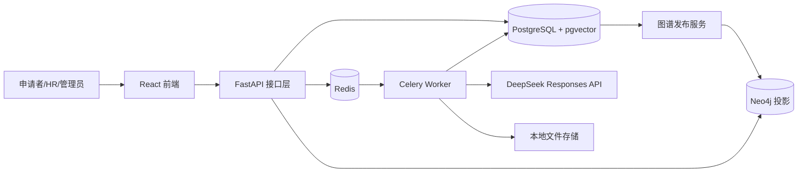
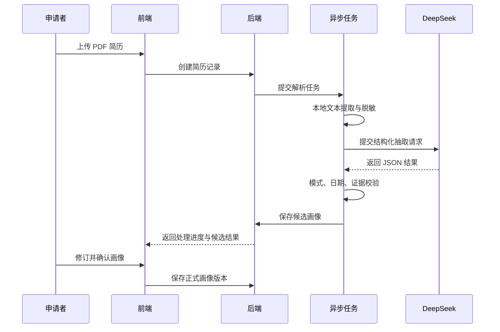

# 面向新质岗位的能力图谱与智能人岗匹配系统：研究报告技术文档

> 文档性质：研究报告写作底稿与系统技术说明
> 项目名称：Job Capability Graph（岗位能力图谱系统）
> 文档日期：2026 年 10 月 4 日
> 适用对象：项目研究报告、结题材料、系统设计说明与后续实验方案

## 摘要

传统招聘系统通常以职位名称、关键词重合度或简历年限作为主要匹配依据，难以解释跨专业人才如何将既有知识、项目经验与通用能力迁移到数字化、智能化和交叉型新质岗位。本项目构建了一套“专业背景—证据—能力—岗位族—岗位角色”的可解释能力图谱系统：以 9 项硬技能作为岗位准入与差距维度，以 24 项可迁移软能力描述跨专业潜力，共形成 33 项固定能力本体；以行为锚定等级量表（Behaviorally Anchored Rating Scales，BARS）统一能力的 1—5 级判定；以文献先验、岗位描述数据校准和人工确认共同约束权重与画像质量；在工程上形成岗位目录管理、图谱发布、简历结构化抽取、证据确认、人岗匹配和成长路径生成的完整链路。

系统前端采用 React、TypeScript、Vite、Ant Design 与 Three.js，后端采用 FastAPI、Pydantic、SQLAlchemy Async、PostgreSQL 16 与 pgvector，并通过 Redis、Celery 和 Neo4j 支撑异步计算及图谱投影。生成式模型只承担受约束的信息抽取，不直接决定最终评分；匹配分数由确定性算法依据已发布版本计算，从而兼顾可解释性、可复现性和审计能力。一次真实 PDF 简历端到端验证已经完成：系统成功提取 1 条教育经历、6 个项目和 14 项技能，处理任务达到 100%，画像可确认并在前端刷新后恢复。由于当前数据库尚未导入并发布正式能力目录和岗位图谱，14 项技能均处于未映射状态，推荐模块按设计返回“当前没有正式图谱版本”。该结果验证了简历链路的工程可行性，但不能作为抽取准确率或推荐有效性的统计证据。

**关键词：** 能力图谱；新质岗位；跨专业迁移；简历信息抽取；行为锚定量表；可解释推荐；人岗匹配

## 1. 研究背景与问题定义

### 1.1 研究背景

新质生产力相关岗位往往呈现知识交叉、技能更新快、岗位名称不稳定等特征。仅依靠“专业名称等于岗位名称”的规则容易低估复合型人才，仅依靠关键词相似度又会把“简历出现过某词”误认为“具备可验证能力”。因此，系统需要同时回答三个问题：候选人具备什么能力、判断依据是什么、与目标岗位之间还缺什么。

本研究采用能力本位视角，将专业教育视为能力形成的来源之一，而不是岗位资格的唯一代理变量。系统保留专业知识的先验价值，同时通过项目、实践、作品和工作证据修正先验判断，使跨专业迁移具备可计算、可解释的表达形式。

### 1.2 研究问题

- **RQ1：** 如何建立稳定、可版本化且适用于多类新质岗位的能力本体？
- **RQ2：** 如何把专业背景翻译为可迁移能力，并控制过度推断风险？
- **RQ3：** 如何从非结构化简历中提取带原文证据的能力画像？
- **RQ4：** 如何综合能力、知识基础和教育背景，同时单独呈现硬技能差距？
- **RQ5：** 如何使推荐结果可解释、可审计、可复现，并支持人工修正？

### 1.3 研究目标与贡献

本项目的目标不是让大语言模型直接替代招聘判断，而是建立一个“模型抽取、规则校验、人工确认、确定性评分”的协作框架。主要贡献包括：

1. 提出由 9 项硬技能和 24 项可迁移软能力组成的双轨能力模型。
2. 将专业大类、可迁移能力、岗位族和具体岗位组织为版本化知识图谱。
3. 使用 1—5 级 BARS 行为锚点，使能力等级具有可观察的判定依据。
4. 将综合适配度与硬技能缺口分离，避免单一总分掩盖岗位准入风险。
5. 将生成式模型限制在结构化抽取环节，保留证据定位、模式校验和人工确认。
6. 构建可运行的前后端原型，并对真实简历处理链路进行了端到端验证。

## 2. 理论模型与业务本体

### 2.1 双轨能力模型

能力集合定义为：

```text
C = H ∪ T，且 H ∩ T = ∅
```

其中，`H` 为 9 项硬技能集合，强调具体工具、方法或专业技术的掌握程度；`T` 为 24 项可迁移软能力集合，强调可跨任务、跨领域复用的认知、协作和执行特征。双轨设计的意义在于：软能力用于解释迁移潜力，硬技能用于揭示岗位适配的现实差距。二者不能互相替代。

能力目录固定为 33 项，具体名称、定义、类别、别名和行为锚点由版本化框架文件维护。前端与后端均使用同一版本语义，避免界面展示与评分逻辑产生概念漂移。

### 2.2 多维分类

33 项能力除“硬技能/软能力”的主分类外，还可以按以下维度组织：

| 维度 | 作用 | 典型用途 |
|---|---|---|
| 能力性质 | 区分技术能力与可迁移能力 | 差距诊断、培养方案 |
| 认知层级 | 区分理解、分析、综合与创新 | BARS 等级解释 |
| 行为场景 | 区分独立执行、协作、管理与研究 | 证据分类 |
| 岗位关联 | 表示能力对岗位族的重要度 | 图谱边权重 |
| 证据来源 | 区分教育、项目、工作、作品等 | 置信度计算 |

这种多维组织不增加重复能力节点，而是通过属性和关系表达不同视角，保持本体稳定。

### 2.3 BARS 行为锚定等级

每项能力采用 1—5 级行为锚定。等级不是自我评价强弱，而是证据所能支持的最高可观察行为水平：

| 等级 | 通用含义 | 证据要求示例 |
|---:|---|---|
| 1 | 了解概念或在指导下参与 | 课程学习、辅助性任务 |
| 2 | 能完成边界明确的常规任务 | 有具体任务与产出描述 |
| 3 | 能独立解决完整问题 | 明确责任、过程与可验证结果 |
| 4 | 能处理复杂情境并带动他人 | 跨团队、优化、指导或系统性成果 |
| 5 | 能建立方法、形成创新或产生广泛影响 | 原创方法、规模化应用、显著外部影响 |

实际判断应使用每项能力的专属锚点，而非只使用上述通用表。若证据只支持等级 2，模型不得因措辞华丽而推断为等级 4。能力等级的最终确认应允许用户或审核人员修订。

### 2.4 三态语义

系统对能力状态至少区分三类：

- **已证明（demonstrated）：** 有可定位的简历证据，并通过规则或人工确认。
- **待确认（inferred/pending）：** 存在关联线索，但证据不足或映射存在歧义。
- **未观察到（not observed）：** 当前材料没有证据，不等同于候选人不具备。

该语义可以降低“没有写在简历上”等同于“没有能力”的偏差。研究报告中应避免将未观察到描述为缺失事实。

### 2.5 专业到岗位的翻译链路

系统采用如下映射，而不是从专业名称直接跳转到岗位：

```text
专业背景 → 知识基础/训练方式 → 可迁移能力 → 岗位族 → 具体岗位
```

岗位族目前分为四类：J1 数字内容与人文、J2 数据与分析、J3 产品与管理、J4 交叉研究。专业背景提供先验分布，项目和实践证据负责校准。别名映射采用保守、精确原则：只有语义明确等价时才自动归一化；上位词、相邻概念或可能相关的技能进入待确认状态。

## 3. 研究数据与权重依据

### 3.1 数据概况

现有材料报告了 59,430 条岗位描述（JD）记录，其中 71.4% 为新工科技术类岗位；非新工科子集为 11,126 条，占 18.7%。这一分布说明样本对技术岗位具有明显倾斜。因而，基于该数据得到的权重只能表述为“文献先验加方向性子集校准”，不能宣称为对所有专业和岗位普遍最优的参数。

### 3.2 综合匹配权重

核心综合分采用以下设计：

```text
综合匹配分 = 0.45 × 综合素质得分
           + 0.40 × 知识基础得分
           + 0.15 × 教育背景得分
```

45% 的综合素质强调可迁移能力和行为证据，40% 的知识基础保留岗位所需领域知识，15% 的教育背景作为先验而非决定性门槛。硬技能缺口不直接被该总分吸收，而作为独立维度展示，以避免较强软能力完全抵消关键技能缺失。

该权重是待检验研究假设。正式论文应通过验证集、消融实验及不同专业/岗位分组评估其稳健性，并报告置信区间或重复抽样结果。

## 4. 系统总体设计

### 4.1 设计原则

- **单一事实源：** PostgreSQL 保存业务事实、版本状态与评分输入。
- **投影而非双主库：** Neo4j 是已发布图谱的查询投影，不承担事务事实源角色。
- **版本冻结：** 推荐结果必须绑定目录版本、图谱版本和算法版本。
- **证据优先：** 能力判断必须尽可能关联原文片段和来源位置。
- **人在回路：** 低置信度映射、能力等级和画像确认均保留人工入口。
- **确定性评分：** 大模型不直接生成最终匹配分数。
- **异步隔离：** 文档解析、模型调用和图谱发布由任务队列执行。

### 4.2 逻辑架构



### 4.3 技术栈与职责

| 层次 | 技术 | 主要职责 |
|---|---|---|
| 前端 | React、TypeScript、Vite、Ant Design | 业务流程、状态展示、人工确认 |
| 可视化 | Three.js | 能力与岗位关系的空间化展示 |
| API | FastAPI、Pydantic | 鉴权、输入校验、业务接口和 OpenAPI |
| ORM | SQLAlchemy Async | 异步事务与模型映射 |
| 主数据库 | PostgreSQL 16、pgvector | 业务事实、向量、版本和审计数据 |
| 图数据库 | Neo4j | 已发布图谱的关系查询投影 |
| 异步任务 | Redis、Celery | 解析、抽取、导入和发布 |
| 大模型 | DeepSeek Responses API | 受结构约束的简历信息抽取 |
| 部署 | Docker Compose | 本地与研究环境的一致化部署 |

## 5. 核心数据模型与版本管理

### 5.1 主要实体

| 实体 | 说明 | 关键关系 |
|---|---|---|
| User | 申请者、HR 或管理员 | 拥有简历、操作记录 |
| Resume / Profile | 原始简历及确认后的结构化画像 | 关联教育、项目、技能与证据 |
| Capability | 33 项标准能力节点 | 连接别名、岗位和 BARS |
| CapabilityAlias | 技能表达的规范化映射 | 指向唯一标准能力 |
| JobFamily | 四类岗位族 | 包含多个岗位角色 |
| JobRole | 具体岗位 | 关联能力要求及权重 |
| CatalogVersion | 能力目录版本 | 冻结能力定义和框架载荷 |
| GraphVersion | 图谱发布版本 | 绑定目录快照和发布状态 |
| MatchResult | 一次推荐或评估结果 | 绑定画像、岗位与算法版本 |

### 5.2 版本状态机

目录和图谱遵循“草稿—校验—发布—归档”的生命周期。只有正式发布版本进入推荐计算。发布时应完成：本体完整性检查、边权重范围检查、孤立节点检查、别名冲突检查、关系投影与版本哈希记录。

这一机制保证历史推荐可以复现：即使后续调整了能力定义或岗位权重，旧结果仍能根据其绑定版本解释。

### 5.3 PostgreSQL 与 Neo4j 的边界

PostgreSQL 保存用户数据、简历、画像、能力目录、岗位要求、发布记录和推荐结果，是唯一事务事实源。Neo4j 只接收正式版本的节点和边投影，用于多跳关系查询及图谱展示。若 Neo4j 投影失败，发布记录应保持失败或回滚状态，不能把未完成投影标为正式版本。

## 6. 岗位图谱构建闭环

### 6.1 数据进入与规范化

岗位描述首先进入导入任务，经过字段解析、文本清洗、重复检测和来源记录后成为待处理记录。能力抽取提示词要求模型只返回模式允许的字段，并给出能力名称、证据文本、建议等级和置信信息。随后，系统以标准名称和别名表执行规范化。

规范化遵循以下优先级：

1. 标准能力名称完全匹配。
2. 经审核的别名精确匹配。
3. 语义候选召回，但进入人工复核，不能自动确认为同义项。
4. 无可靠候选时保留为未映射技能，避免强行归类。

### 6.2 岗位需求聚合

对同一岗位或岗位族的多个 JD，可统计能力出现频率、要求等级和共现关系，形成岗位需求画像。建议将边权定义为可解释的组合量：

```text
岗位能力权重 = α × 文献先验
             + β × JD 出现强度
             + γ × 专家修正
```

其中 `α + β + γ = 1`。当前材料提供了文献先验和方向性数据校准依据，正式实验仍需报告各参数取值、样本划分和专家修正规则。

### 6.3 人工审核与发布

管理员工作台用于处理未映射技能、别名冲突、能力等级异常和岗位关系审核。只有审核通过的目录与关系可以创建正式图谱版本。发布完成后，版本同时服务于图谱浏览、简历映射、岗位推荐和成长路径生成。

## 7. 简历画像抽取与可信性设计

### 7.1 处理流程



### 7.2 本地解析与最小化传输

文件先在本地提取文本。进入外部模型前，应移除与能力判断无关的敏感字段，并遵循最小必要原则。原始文件、抽取文本、模型响应与确认画像应分别设置访问权限和保留周期。研究数据如需导出，应匿名化并移除可回溯身份的自由文本。

### 7.3 模型调用约束

系统通过 DeepSeek Responses API 执行结构化抽取。请求定义固定 JSON 结构，字段包括教育、工作、项目、技能和证据等。简历抽取使用 `reasoning_effort="none"`，原因是该任务以忠实抽取为主，过长推理会增加输出被截断和生成额外推断的概率。

当响应处于 incomplete 状态时，客户端会提高输出 token 限制并重试；校验错误只记录安全诊断信息，不打印密钥或完整隐私文本。日期规则明确要求：只有当前仍在进行的经历可以使用 `is_current=true`，且此时 `end_month` 必须为空。

### 7.4 证据约束与置信机制

每项能力应关联简历原文片段。建议将证据强度分为：

| 证据等级 | 系数 | 定义 |
|---|---:|---|
| 弱证据 | 0.40 | 仅列出名词或课程，无行为和结果 |
| 中证据 | 0.70 | 描述了任务或过程，但结果有限 |
| 强证据 | 1.00 | 同时包含行为、责任、方法和可验证结果 |

系统应验证证据片段确实存在于解析文本中；无法命中的引文不得作为已证明能力。模型建议等级还需接受 BARS 上限、日期一致性、去重和枚举校验。

### 7.5 人工确认

抽取结果只是候选画像。用户可以修改教育经历、项目、技能映射、证据和能力等级，再执行“确认画像”。后续匹配默认使用已确认版本。该设计把自动化错误限制在可见、可修订的中间态，并为研究实验保留“模型输出”和“人工金标准”的对照数据。

## 8. 人岗匹配方法

### 8.1 输入与输出

匹配输入包括已确认画像、目标岗位、正式目录版本、正式图谱版本和算法版本。输出至少包括综合分、三个分项、硬技能覆盖率、关键缺口、证据摘要和推荐解释。

### 8.2 能力覆盖率

对岗位能力集合 `R`，候选人能力等级记为 `p_i`，岗位要求等级记为 `r_i`，岗位权重记为 `w_i`，则可定义加权覆盖率：

```text
coverage = Σ[w_i × min(p_i / r_i, 1)] / Σw_i
```

如果能力证据强度为 `e_i`，可进一步使用 `p_i × e_i` 作为有效能力等级。该处理使只有技能名、没有行为证据的条目不会获得与强证据相同的贡献。

### 8.3 综合评分与硬技能差距

综合得分按 45/40/15 计算。硬技能单独计算覆盖率和缺口：

```text
硬技能缺口_i = max(岗位要求等级_i - 候选人有效等级_i, 0)
```

建议将结果划分为：综合分不低于 75 为高适配，50—74.99 为发展型适配，低于 50 为暂不推荐。阈值目前是产品解释规则，必须在带标签数据上校准后才能作为经验结论。

### 8.4 兼容算法

项目仍保留一套历史加权公式，用于回归比较：

```text
legacy_score = 0.55 × 技能匹配
             + 0.10 × 经验匹配
             + 0.15 × 项目匹配
             + 0.15 × 教育匹配
             + 0.05 × 其他因素
```

研究报告应把历史公式视为基线，不应与新的 45/40/15 理论模型混合陈述。两者可通过相同测试集比较 Top-K 推荐质量、解释覆盖率和跨专业公平性。

### 8.5 解释生成

推荐解释由确定性评分明细生成，而非要求模型自由撰写结论。解释模板应回答：

- 哪些已证明能力支持该岗位；
- 每项判断引用了哪些证据；
- 哪些硬技能尚未达到要求；
- 专业背景通过何种可迁移能力产生关联；
- 推荐结果绑定哪个目录、图谱和算法版本。

## 9. 成长路径生成

成长路径以能力缺口为起点，将缺口按岗位权重、等级差和前置依赖排序。建议优先级为：

```text
priority_i = 岗位权重_i × 等级差_i × (1 - 当前覆盖度_i)
```

输出不应只是课程列表，而应给出“目标能力—当前等级—目标等级—建议行动—可验收证据”。例如，目标从数据分析等级 1 提升到等级 2，行动可以是完成一个含数据清洗、分析和可视化的项目，验收证据为代码仓库、分析报告和结果复盘。成长路径属于建议，不等同于资格承诺。

## 10. 前端业务流程

### 10.1 申请者流程

申请者可以完成登录、上传简历、查看处理进度、修订画像、确认能力证据、浏览岗位推荐、查看能力差距与成长路径。页面刷新后从后端恢复已持久化画像，避免只依赖浏览器临时状态。

### 10.2 HR 流程

HR 工作区用于查看岗位与候选人的适配结果，重点展示能力证据和缺口，而非只展示排名。所有筛选和推荐结果应注明版本及更新时间，以支持审核。

### 10.3 管理与审核流程

管理员中心负责用户和系统状态，审核中心负责未映射技能、别名候选、目录修改及发布前质量检查。新质岗位页面展示岗位族和角色信息，空间图谱页面展示专业、能力和岗位之间的关系。

### 10.4 交互状态要求

前端应明确区分加载中、处理中、已完成、失败、空数据和缺少正式版本。当前没有正式图谱时，界面必须解释阻断原因并引导管理员导入和发布，而不能显示伪造推荐或无限加载。

## 11. API 与服务边界概览

| 领域 | 典型能力 | 调用特征 |
|---|---|---|
| Authentication | 登录、令牌刷新、当前用户 | 同步、需鉴权 |
| Resumes | 上传、列表、详情、确认画像 | 上传同步，处理异步 |
| Processing | 任务状态、进度与错误 | 轮询或事件更新 |
| Catalog | 能力、别名、岗位与目录版本 | 管理操作需权限 |
| Graph | 图谱版本、发布、关系查询 | 发布异步，查询只读 |
| Matching | 岗位评估、推荐与解释 | 依赖正式版本 |
| Recruitment | HR 候选匹配与批处理 | 权限隔离、可异步 |

具体路径和请求模式以 FastAPI 自动生成的 OpenAPI 文档为准。研究报告宜描述领域职责，不宜手工复制一份容易失效的完整接口清单。

## 12. 可靠性、安全与可观测性

### 12.1 幂等性与重试

上传、抽取、发布和批量匹配需要业务幂等键，避免网络重试产生重复记录。模型调用仅对超时、限流或 incomplete 等可恢复错误重试；模式不合法需记录失败原因并进入可人工重跑状态。

### 12.2 异步事件循环修复

Celery 同步任务包装器会为异步代码创建事件循环。旧实现复用绑定到已关闭循环的数据库连接，可能产生跨事件循环错误。当前实现通过统一 `run_worker()` 包装，在每个任务循环关闭前释放异步引擎连接池，相关任务均迁移到该入口，并增加回归测试。该修复避免将数据库运行时错误误判为模型 API 故障。

### 12.3 安全要求

- API 密钥仅通过环境变量或密钥管理系统注入，不进入代码、日志和研究文档。
- 密码只保存强哈希，管理员初始化脚本不得输出明文凭据到长期日志。
- 简历文件与画像实行用户隔离和最小权限。
- 模型错误日志不得包含完整简历、访问令牌或模型密钥。
- 研究数据导出需匿名化，并记录授权、用途和保留期限。

### 12.4 可观测性

每个处理任务应记录任务 ID、用户 ID、输入版本、模型名、提示词版本、重试次数、耗时、token 使用、校验结果和最终状态。匹配任务还应记录目录版本、图谱版本、算法版本和分项得分。日志与指标用于定位问题，但不能替代审计数据。

## 13. 实验设计与验证方案

### 13.1 当前工程验证结果

项目已使用一份真实的一页 PDF 简历完成端到端测试。为保护隐私，本文仅报告聚合结果：

| 验证项 | 结果 |
|---|---|
| PDF 文本解析 | 成功，约 3,410 个字符 |
| 异步处理 | 完成，进度 100% |
| 画像确认 | 成功 |
| 教育经历 | 1 条 |
| 工作经历 | 0 条 |
| 项目经历 | 6 条 |
| 抽取技能 | 14 项 |
| 已映射技能 | 0 项 |
| 未映射技能 | 14 项 |
| 页面刷新恢复 | 成功恢复持久化画像 |
| 后端相关测试 | 118 项通过（隔离测试数据库） |
| 前端生产构建 | 通过 |
| 跨事件循环错误 | 修复后未复现 |

0 项映射的直接原因是运行数据库中的 `capabilities`、`job_roles`、`catalog_versions` 和 `graph_versions` 均为 0。系统因此按设计提示“当前没有正式图谱版本”。这不是 DeepSeek API 密钥或简历解析失败，而是基础目录尚未初始化和发布。

以上结果证明了文件上传、异步处理、结构化保存、用户确认和状态恢复链路可以运行；它不证明抽取内容全部正确，也不构成推荐有效性结论。

### 13.2 标注数据集设计

正式研究应建立经过双人标注的测试集。样本需覆盖不同专业大类、岗位族、教育层次、简历长度、项目丰富度和跨专业程度。标注对象包括结构化实体、标准能力映射、证据区间、BARS 等级和适配岗位。两名标注者独立完成后，由第三人仲裁分歧。

为避免数据泄漏，应按候选人划分训练、验证和测试集；同一人的不同简历版本不得跨集合。若使用 JD 数据校准权重，也应按岗位来源或时间切分，避免相同模板同时进入训练与测试。

### 13.3 评估指标

| 任务 | 推荐指标 | 说明 |
|---|---|---|
| 教育/项目/经历抽取 | Precision、Recall、F1 | 按实体或字段严格匹配 |
| 能力映射 | Micro-F1、Macro-F1 | 多标签分类，兼顾高低频能力 |
| 证据定位 | Exact Match、字符级 F1 | 检查引文是否准确对应原文 |
| BARS 等级 | 加权 Cohen's kappa、MAE | 同时衡量一致性与等级偏差 |
| 岗位推荐 | Top-K Recall、NDCG@K | 衡量相关岗位是否被召回及排序质量 |
| 解释质量 | 证据覆盖率、人工有用性评分 | 判断解释是否可验证 |
| 系统性能 | P50/P95 延迟、失败率、重试率 | 评估运行稳定性 |

### 13.4 消融实验

至少比较以下方案：

1. 关键词重合基线。
2. 历史 0.55/0.10/0.15/0.15/0.05 公式。
3. 45/40/15 综合模型。
4. 45/40/15 加独立硬技能缺口。
5. 去除专业背景先验。
6. 去除证据强度系数。
7. 去除人工确认，直接使用模型画像。

消融实验应在同一测试集、同一图谱版本上运行，并报告总体结果以及四个岗位族的分组结果。若参数通过验证集调优，测试集只能在最终方案确定后使用一次。

### 13.5 公平性与稳健性

公平性分析至少按专业大类比较推荐召回率、平均排名和错误类型。研究重点不是要求各组数值完全相同，而是识别专业先验是否系统性压低跨专业候选人。还应测试：删除学校名称、改写同义技能、交换项目顺序、缩短描述等扰动对结果的影响。

### 13.6 统计报告要求

除平均值外，应报告样本量、标准差或置信区间。多次模型抽取实验应固定模型版本、温度和提示词版本，并报告重复运行的一致性。若进行显著性检验，应同时报告效应量，不应只依据 p 值作结论。

## 14. 部署与复现指南

### 14.1 环境前提

- Docker 与 Docker Compose
- 可用的 PostgreSQL、Redis 和 Neo4j 容器资源
- DeepSeek API 密钥，通过环境变量注入
- Node.js 与 Python 环境仅在非容器开发时需要

### 14.2 推荐复现顺序

```bash
# 1. 在项目根目录配置本地环境变量，不要提交密钥文件
cp .env.example .env

# 2. 启动基础服务与应用
docker compose up -d --build

# 3. 执行数据库迁移
docker compose exec backend alembic upgrade head

# 4. 初始化能力框架和岗位目录
docker compose exec backend python scripts/bootstrap_capability_framework.py

# 5. 创建管理员账号（参数以脚本帮助为准）
docker compose exec backend python scripts/create_user.py --help

# 6. 运行后端测试
docker compose exec backend pytest

# 7. 构建前端
docker compose exec frontend npm run build
```

实际服务名应以仓库 `compose.yaml` 为准。正式推荐前必须确认：能力数量大于 0、岗位数量大于 0、存在正式目录版本、存在正式图谱版本，并验证 Neo4j 投影与 PostgreSQL 发布记录一致。

### 14.3 最小验收流程

1. 使用管理员账号登录并检查目录状态。
2. 初始化或导入 33 项能力、别名、BARS 和岗位族。
3. 完成目录校验并发布图谱版本。
4. 使用普通用户上传测试简历。
5. 等待处理完成，检查抽取字段和证据命中。
6. 人工修订并确认画像。
7. 运行岗位推荐，检查总分、分项、硬技能缺口和版本号。
8. 刷新页面并重新登录，确认数据仍可恢复。

### 14.4 可复现性清单

- 代码提交哈希
- 数据库迁移版本
- 能力目录与图谱版本 ID
- 模型名称及提供方版本
- 提示词和 JSON Schema 版本
- 匿名化数据集版本与划分种子
- 评分算法版本和全部参数
- 容器镜像或依赖锁文件
- 测试命令、硬件环境和运行日期

## 15. 局限性与有效性威胁

### 15.1 数据代表性

JD 数据中技术类岗位占比过高，可能使能力权重更偏向新工科语境。非新工科子集虽可进行方向性校验，但不足以证明对所有专业公平有效。

### 15.2 构念效度

33 项能力和 BARS 将复杂的人类能力离散化，可能存在边界重叠、情境依赖和证据不足问题。简历能够观察到的是“被描述的能力表现”，不是个体全部真实能力。

### 15.3 模型有效性

大语言模型可能遗漏信息、错误归因或生成不在原文中的证据。结构化输出、原文命中和人工确认可以降低风险，但不能完全消除错误。

### 15.4 外部效度

当前真实测试只有一个简历样本，且尚无正式图谱支撑推荐，因此不能由此推断系统在大规模真实招聘中的准确率、效率提升或公平性表现。

### 15.5 参数有效性

45/40/15、证据系数和推荐阈值均具有理论与业务合理性，但仍是待检验参数。论文应避免使用“最优权重”“显著提升”等措辞，除非实验设计和统计结果足以支持。

### 15.6 隐私与伦理

简历涉及高敏感个人信息。系统需要获得明确授权、限制数据用途并支持删除。专业、学校等变量可能成为社会背景代理，研究应分析它们是否带来不合理差异，且不得将系统结果作为完全自动化的淘汰依据。

## 16. 后续研究方向

1. 建设平衡覆盖四个岗位族和多专业大类的金标准数据集。
2. 对 33 项能力本体开展专家 Delphi 评审和内部一致性分析。
3. 使用时间切分 JD 验证能力权重随产业变化的稳定性。
4. 引入学习排序模型，但保留版本、证据与可解释约束。
5. 研究图谱多跳路径对跨专业推荐的增益及错误传播风险。
6. 开展用户研究，比较“只有总分”和“证据加差距解释”对决策质量的影响。
7. 建立模型漂移监控，持续跟踪未映射技能和新兴岗位术语。

## 17. 研究报告写作建议

建议最终报告采用“引言—相关研究—理论框架—系统设计—研究方法—实验结果—讨论—结论”的结构。本文的第 2、3 节可转写为理论框架，第 4—12 节可构成系统与方法章，第 13 节构成实验设计，第 15 节构成讨论与局限。

写作时应使用以下证据层级：

- **源码与测试可证明：** 系统采用的技术、接口逻辑、评分实现和测试通过情况。
- **内部研究材料支持：** 能力框架、翻译映射、岗位族、BARS、提示词和先验权重设计。
- **正式实验才能证明：** 抽取准确率、推荐有效性、公平性和权重优越性。
- **未来工作：** 尚未实现或尚未验证的模型与实验。

内部 11—16 号材料是本项目的研究设计输入，但不能代替原始学术文献。最终提交前必须逐条核验原论文、DOI、正式报告或权威统计来源，确保作者、年份、样本量和结论与原文一致。

## 18. 结论

本项目将新质岗位的人才识别问题转化为可审计的能力图谱与证据匹配问题。系统以 33 项能力本体、BARS 等级、专业迁移链路和岗位族为理论基础，以版本化目录、简历结构化抽取、人工确认、确定性评分和图谱投影为工程实现，避免让大模型直接产生不可追溯的招聘结论。

当前工程已验证从 PDF 上传到画像确认的完整链路，并修复了模型输出截断和异步数据库连接等关键问题。尚未完成的核心条件是正式能力目录和图谱版本的初始化与发布；在此之前，系统能够抽取简历，但不能产生有意义的岗位推荐。下一阶段应先完成图谱数据建设，再依据严格标注的数据集开展抽取、排序、公平性和消融实验，最终把“可运行原型”推进为“有实证依据的研究系统”。

## 附录 A：核心代码导航

| 模块 | 路径 | 作用 |
|---|---|---|
| 应用入口 | `backend/app/main.py` | FastAPI 初始化与路由装配 |
| 配置 | `backend/app/core/config.py` | 环境变量与服务配置 |
| 能力框架 | `backend/app/catalog/framework.py` | 固定框架加载与校验 |
| 框架数据 | `backend/app/catalog/framework_v1.json` | 33 项能力及相关定义 |
| 匹配算法 | `backend/app/matching/scoring.py` | 分项、覆盖与综合评分 |
| 模型客户端 | `backend/app/llm/responses.py` | Responses API、重试与校验 |
| 简历抽取 | `backend/app/resumes/llm.py` | 提示词、模式与日期约束 |
| Worker 运行时 | `backend/app/infrastructure/database.py` | 异步引擎生命周期处理 |
| 前端路由 | `frontend/src/routes/index.tsx` | 用户角色与页面入口 |
| 前端框架数据 | `frontend/src/data/capabilityFramework.ts` | 能力展示与交互常量 |
| 容器编排 | `compose.yaml` | 全部服务的本地部署 |

## 附录 B：研究材料与系统实现映射

| 材料 | 研究作用 | 系统落点 |
|---|---|---|
| 11 能力权重：文献先验与 JD 校准 | 权重假设、数据边界 | 匹配算法、实验参数 |
| 12 原专业到新质岗位翻译表 | 迁移解释规则 | 专业—能力—岗位关系 |
| 13 专业大类与岗位族图谱 | 岗位空间组织 | 四类岗位族与图谱节点 |
| 14 能力多维分类总表 | 能力本体与属性 | 33 项能力目录 |
| 15 33 项能力 BARS | 等级判断标准 | 画像确认、岗位要求、差距解释 |
| 16 抽取提示词与别名映射 | 信息抽取和规范化 | LLM Schema、别名表、审核队列 |

## 附录 C：正式引用核验清单

1. 找到每项理论所对应的原始论文或权威报告，而不是只引用内部汇总文件。
2. 核对作者、题目、期刊或机构、年份、卷期页码和 DOI/URL。
3. 核对原文是否真正支持该权重、分类或结论，避免二手转述扩大含义。
4. 对 59,430、71.4%、11,126 和 18.7% 等数字说明数据来源、采集时间和清洗方法。
5. 根据学校要求统一采用 GB/T 7714、APA 或其他指定格式。
6. 对软件框架和模型版本记录访问日期或发布版本，保证技术复现。
